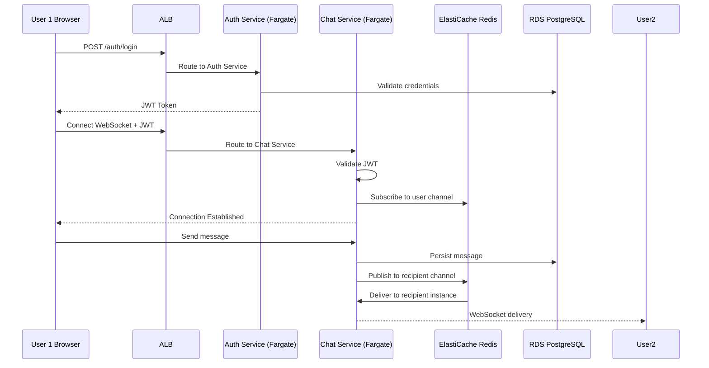

# Cloud-Native Messaging Application on AWS

A secure, scalable, browser-based real-time messaging application deployed on Amazon Web Services. Built on a microservice architecture using containerized FastAPI backends and a React frontend, this project demonstrates modern cloud-native DevOps practices including infrastructure as code, CI/CD, autoscaling, and observability.

## Attribution

This project is based on [fast-api-and-websockets-learning](https://github.com/anuz505/fast-api-and-websockets-learning) by [Anuj Bhandari](https://github.com/anuz505).

The original project is a full-stack real-time chat application built with FastAPI, React, WebSockets, PostgreSQL, and Redis. This fork migrates the application to a production-grade AWS cloud-native deployment, replacing the local Docker Compose setup with managed AWS services, infrastructure as code, and a CI/CD pipeline.

## Team

| Name | GitHub |
|---|---|
| Tijany Momoh | 404Mamba |
| William Lim | FrewtyPebbles|
| Drew Butler | Druwby |
| Joshua Castaneda | ccastaneda85 |

---

## Features

- **Real-time Messaging**: WebSocket-based one-to-one and group chat
- **User Authentication**: JWT-based auth with Argon2 password hashing
- **Friend System**: Send and accept friend requests
- **User Discovery**: Search and find other users
- **Horizontally Scalable Backend**: Multiple FastAPI instances coordinated via Redis Pub/Sub
- **Cloud-Native Deployment**: Fully managed AWS infrastructure with autoscaling

---

## Architecture

### AWS Architecture Overview

```
                        ┌─────────────────────────────────────┐
                        │           Amazon CloudFront         │
                        │     (CDN + TLS termination)         │
                        └──────────────┬──────────────────────┘
                                       │
                 ┌─────────────────────┼──────────────────────┐
                 │                     │                      │
                 ▼                     ▼                      │
        ┌──────────────┐    ┌─────────────────────┐           │
        │  Amazon S3   │    │  Application Load   │           │
        │ (React SPA / │    │  Balancer (ALB)     │           │
        │static assets)│    │                     │           │
        └──────────────┘    └──────────┬──────────┘           │
                                       │                      │
                         ┌─────────────┴─────────────┐        │
                         │                           │        │
                         ▼                           ▼        │
              ┌──────────────────┐       ┌──────────────────┐ │
              │   Auth Service   │       │   Chat Service   │ │
              │  (ECS Fargate)   │       │  (ECS Fargate)   │ │
              └────────┬─────────┘       └────────┬─────────┘ │
                       │                          │           │
              ┌────────┴──────────────────────────┘           │
              │                                               │
   ┌──────────┴──────────┐              ┌────────────────────┐│
   │  Amazon RDS         │              │  Amazon            ││
   │  PostgreSQL         │              │  ElastiCache Redis ││
   │  (users, messages,  │              │  (pub/sub,         ││
   │   chat history)     │              │   caching,         ││
   └─────────────────────┘              │   presence)        ││
                                        └────────────────────┘│
                                                              │
        ┌─────────────────────────────────────────────────────┘
        │  Supporting Services
        │  ┌────────────────┐  ┌──────────────────┐  ┌──────────────────┐
        └─▶│ Amazon ECR     │  │ AWS Secrets Mgr  │  │ Amazon CloudWatch│
           │ (container     │  │ (credentials,    │  │ (logs, metrics,  │
           │  registry)     │  │  JWT secrets)    │  │  monitoring)     │
           └────────────────┘  └──────────────────┘  └──────────────────┘
```

### WebSocket Message Flow



---

## Technology Stack

### Frontend
- **React** — UI framework
- **TypeScript** — Type safety
- **Vite** — Build tool
- **Redux Toolkit** — State management
- **React Query** — Server state
- **TailwindCSS 4** — Styling
- **Axios** — HTTP client

### Backend
- **FastAPI** — Python async web framework
- **WebSockets** — Real-time bidirectional messaging
- **asyncpg** — Async PostgreSQL driver
- **JWT + Argon2** — Authentication and password hashing
- **Pydantic** — Data validation

### AWS Infrastructure
| Service | Role |
|---|---|
| Amazon ECS + Fargate | Run and autoscale containerized microservices |
| Amazon ECR | Docker image registry |
| Application Load Balancer (ALB) | Reverse proxy, TLS termination, routing |
| Amazon RDS for PostgreSQL | Managed relational database |
| Amazon ElastiCache for Redis | Pub/Sub, caching, and user presence |
| Amazon S3 + CloudFront | Host and deliver the React frontend globally |
| AWS Secrets Manager | Store credentials, JWT secrets, and config |
| Amazon CloudWatch | Centralized logging, metrics, and alerting |

### DevOps
- **Terraform** — Infrastructure as Code
- **GitHub Actions** — CI/CD pipeline
- **Docker / Docker Compose** — Local development and image builds
- **GitHub** — Version control
- **GitHub Copilot / Claude** — Coding assistants

---

## Project Structure

```
Chat/
├── server/                 # FastAPI backend
│   ├── app/
│   │   ├── main.py
│   │   ├── api/
│   │   │   ├── auth.py
│   │   │   ├── friends.py
│   │   │   ├── message.py
│   │   │   └── websocket.py
│   │   ├── core/
│   │   ├── db/
│   │   └── models/
│   ├── Dockerfile
│   └── requirements.txt
│
├── client/                 # React frontend
│   ├── src/
│   │   ├── App.tsx
│   │   ├── components/
│   │   ├── api/
│   │   ├── hooks/
│   │   ├── store/
│   │   └── types/
│   ├── package.json
│   └── vite.config.ts
│
├── terraform/              # Infrastructure as Code
│   ├── main.tf
│   ├── ecs.tf
│   ├── rds.tf
│   ├── elasticache.tf
│   ├── alb.tf
│   ├── cloudfront.tf
│   └── variables.tf
│
├── .github/
│   └── workflows/          # GitHub Actions CI/CD pipelines
│
├── docker-compose.yml      # Local development
└── readme.md
```

---

## Project Phases

| Phase | Description |
|---|---|
| **Phase 1** | Requirements analysis and system design |
| **Phase 2** | Application development (auth service, chat service, frontend) |
| **Phase 3** | AWS infrastructure setup via Terraform |
| **Phase 4** | Testing, CI/CD pipeline, and production deployment |

---

## Local Development

### Prerequisites

- Docker and Docker Compose
- Node.js 18+
- Python 3.11+

### Quick Start

```bash
git clone https://github.com/CSUF-Akatsuki/Chat.git
cd Chat
docker-compose up -d
```

Access:
- Frontend: http://localhost:5173
- Backend instances: http://localhost:4001, :4002, :4003

### Backend Setup (without Docker)

```bash
python -m venv venv
source venv/bin/activate  # Windows: venv\Scripts\activate
cd server/app
pip install -r requirements.txt
```

Create `server/app/.env`:

```env
POSTGRES_HOST=localhost
POSTGRES_PORT=5432
POSTGRES_USER=postgres
POSTGRES_PASSWORD=postgres
POSTGRES_DB=chat-app
REDIS_HOST=localhost
REDIS_PORT=6379
SECRET_KEY=your-secret-key-here
```

```bash
uvicorn main:app --reload --port 8000
```

### Frontend Setup (without Docker)

```bash
cd client
npm install
npm run dev
```

---

## API Endpoints

### Authentication
- `POST /api/auth/register` — Register new user
- `POST /api/auth/login` — Login and receive JWT token
- `GET /api/auth/me` — Get current user info

### Friends
- `GET /api/friends` — List friends
- `POST /api/friends/request` — Send friend request
- `POST /api/friends/accept` — Accept friend request
- `GET /api/friends/suggestions` — Get friend suggestions
- `GET /api/friends/requests` — Get pending requests

### Messages
- `GET /api/messages/{user_id}` — Get conversation history
- `POST /api/messages` — Send a message

### WebSocket
- `WS /ws` — Real-time messaging
  - First message must authenticate: `{"type": "auth", "content": "<JWT_TOKEN>"}`

---

## License

This project is open source and available for learning and educational purposes.
