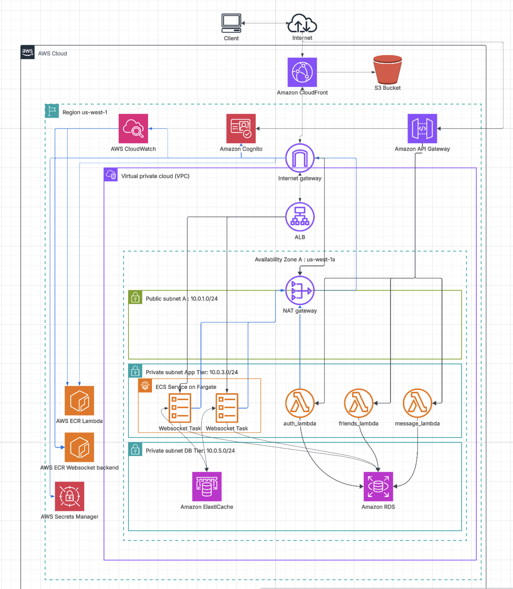
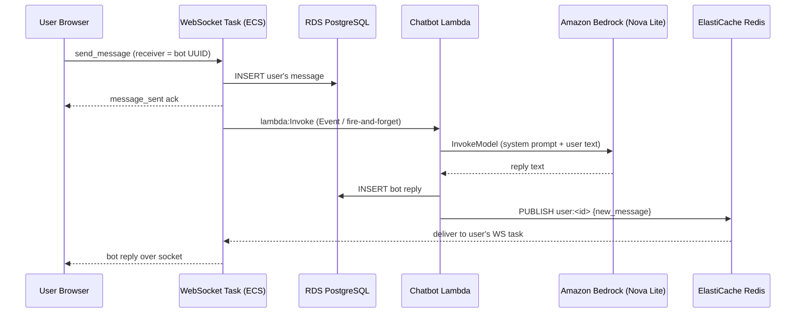
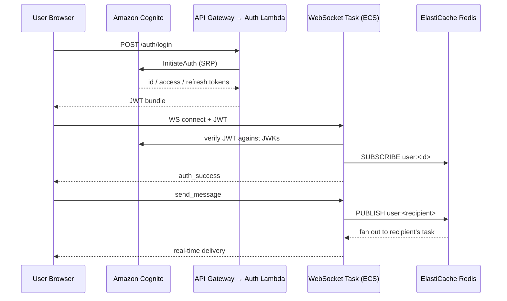

# CPSC465Chat — Cloud-Native Messaging on AWS

A secure, scalable, browser-based real-time messaging application deployed on Amazon Web Services. The project demonstrates a hybrid serverless + container architecture: stateless REST endpoints run on AWS Lambda behind API Gateway, while stateful WebSocket connections run on ECS Fargate with Redis pub/sub for cross-instance fan-out.

**Live demo:** https://d14v638rpcg3lp.cloudfront.net

> Note for graders: this project began as a fork of an open-source FastAPI/React chat tutorial. All AWS architecture, infrastructure-as-code, Cognito integration, Lambda microservices, the AI chatbot feature, and CI/CD are original work by our team.

## Attribution

Originally based on [fast-api-and-websockets-learning](https://github.com/anuz505/fast-api-and-websockets-learning) by [Anuj Bhandari](https://github.com/anuz505). The upstream project is a local-only Docker Compose chat app; this fork rebuilt it as a production AWS deployment with managed services, Cognito auth, an AI chatbot, infrastructure-as-code, and CI/CD.

## Team

| Name | GitHub | Role |
|---|---|---|
| Joshua Castaneda | ccastaneda85 | Team Lead / DevOps |
| William Lim | FrewtyPebbles | Refactored backend application layer into serverless Lambda and ECS Fargate microservices. |
| Tijany Momoh | 404Mamba | |
| Drew Butler | Druwby | |

---

## Features

- **Real-time messaging** over WebSockets, scaled across multiple ECS tasks via Redis Pub/Sub
- **AWS Cognito authentication** with hosted user pool, JWT verification against pool JWKs, and refresh-token persistence
- **AI chatbot first-friend** — every new user is automatically friended with "Mutalip Kurban", an Amazon Bedrock-powered AWS expert chatbot
- **Friend system** — send / accept / reject / block requests, suggested-friends discovery
- **Conversation history** persisted in PostgreSQL, retrievable via REST
- **Single-page React frontend** served from S3 + CloudFront with SPA fallback
- **Three-tier VPC** (public / private-app / private-db) with security-group based isolation
- **Continuous deployment** of the frontend via GitHub Actions

---

## Architecture



### Hybrid serverless + container design

The backend is deliberately split across two compute models:

- **AWS Lambda + API Gateway** — All stateless REST endpoints (`/auth/*`, `/friends/*`, `/messages/*`). Each endpoint is its own Lambda function packaged as a container image from ECR. Lambdas scale to zero when idle and we pay only per-invocation.
- **ECS Fargate** — The WebSocket server, which holds long-lived connections and cannot scale to zero. Runs as 2+ tasks behind an ALB. Tasks coordinate cross-instance message delivery via ElastiCache Redis pub/sub.

This split lets us minimize idle cost (the chat app is mostly quiet) while keeping the real-time path stable.

### AI chatbot flow (Bedrock + fire-and-forget Lambda)


```mermaid
sequenceDiagram
    participant User as User Browser
    participant WS as WebSocket Task (ECS)
    participant DB as RDS PostgreSQL
    participant Bot as Chatbot Lambda
    participant Bedrock as Amazon Bedrock (Nova Lite)
    participant Redis as ElastiCache Redis

    User->>WS: send_message (receiver = bot UUID)
    WS->>DB: INSERT user's message
    WS-->>User: message_sent ack
    WS->>Bot: lambda:Invoke (Event / fire-and-forget)
    Bot->>Bedrock: InvokeModel (system prompt + user text)
    Bedrock-->>Bot: reply text
    Bot->>DB: INSERT bot reply
    Bot->>Redis: PUBLISH user:<id> {new_message}
    Redis-->>WS: deliver to user's WS task
    WS-->>User: bot reply over socket
```

The user's `message_sent` ack is decoupled from the bot reply — if Bedrock is slow or fails, the user's outgoing message is never blocked. On Bedrock failure the Lambda sends a hardcoded fallback reply.

### WebSocket auth + delivery flow


```mermaid
sequenceDiagram
    participant User as User Browser
    participant Cognito as Amazon Cognito
    participant API as API Gateway → Auth Lambda
    participant WS as WebSocket Task (ECS)
    participant Redis as ElastiCache Redis

    User->>API: POST /auth/login
    API->>Cognito: InitiateAuth (SRP)
    Cognito-->>API: id / access / refresh tokens
    API-->>User: JWT bundle

    User->>WS: WS connect + JWT
    WS->>Cognito: verify JWT against JWKs
    WS->>Redis: SUBSCRIBE user:<id>
    WS-->>User: auth_success

    User->>WS: send_message
    WS->>Redis: PUBLISH user:<recipient>
    Redis-->>WS: fan out to recipient's task
    WS-->>User: real-time delivery
```

---

## Technology Stack

### Frontend
- **React 19** + **TypeScript** + **Vite**
- **Redux Toolkit** for global state (auth, conversations)
- **TailwindCSS v4** for styling
- **Axios** for REST, native WebSocket for real-time

### Backend
- **FastAPI** (WebSocket server on ECS Fargate)
- **AWS Lambda** (Python 3.11) for REST endpoints, packaged as container images
- **asyncpg** for PostgreSQL access
- **pycognito** for Cognito SRP auth
- **boto3** for Bedrock + Lambda invocation
- **Pydantic v2** for validation

### AWS Infrastructure

| Service | Role |
|---|---|
| **Amazon Cognito** | User pool, sign-up / login, JWT issuance |
| **Amazon API Gateway (HTTP API)** | Public entry for all REST endpoints |
| **AWS Lambda** | Stateless REST microservices (auth, friends, messages, chatbot) |
| **Amazon Bedrock** (Nova Lite) | AI replies for the Mutalip chatbot |
| **Amazon ECS + Fargate** | Long-lived WebSocket server tasks |
| **Application Load Balancer** | TLS termination + routing to ECS tasks |
| **Amazon RDS for PostgreSQL** | Users, friendships, messages |
| **Amazon ElastiCache for Redis** | WebSocket pub/sub for cross-task fan-out |
| **Amazon S3 + CloudFront** | React SPA hosting + CDN with SPA fallback |
| **Amazon ECR** | Container registry for Lambdas + WebSocket image |
| **AWS Secrets Manager** | DB / Redis / JWT credentials, never in code |
| **Amazon CloudWatch** | Centralized logs for ECS + every Lambda |
| **Amazon VPC** | Three-tier subnet layout (public / private-app / private-db) |

### DevOps
- **Terraform** — Cognito, Lambdas, API Gateway, IAM, ECR (`infra/`)
- **GitHub Actions** — frontend build + S3 deploy on push to `main` (`.github/workflows/main.yml`)
- **Docker buildx** — multi-arch (arm64) Lambda + ECS images, pushed to ECR
- **Docker Compose** — local development (`docker-compose.yml`)

---

## Security & Cost Posture

### Security
- **Three-tier VPC**: public subnet (ALB, NAT), private-app subnet (ECS tasks, Lambdas), private-db subnet (RDS, ElastiCache). Nothing in the database tier is reachable from the internet.
- **Security-group chaining**: `sg-rds` allows inbound only from `sg-ecs` and `sg-lambda`; `sg-redis` likewise. No CIDR-based DB ingress.
- **Cognito-managed auth**: passwords never touch our servers; tokens verified against pool JWKs.
- **Secrets Manager**: every DB / Redis / JWT credential is fetched at runtime; nothing is checked into git.
- **IAM least privilege**: Bedrock policy is scoped to a single foundation model ARN; the WebSocket task role is scoped to invoke only the chatbot Lambda.

### Cost
Estimated **~$40–50 / month** in steady-state demo conditions:
- NAT Gateway is the dominant fixed cost (~$33/mo). It can be torn down between active development cycles — see `infra/` runbooks.
- RDS can be stopped when not testing (saves another ~$15/mo).
- Lambdas + Bedrock + S3 + CloudFront + ECR are pennies at our traffic level.

---

## Project Structure

```
Chat/
├── backend/                       # Python backend
│   ├── lambdas/                   # Lambda handlers (one per microservice)
│   │   ├── auth_lambda.py         # Cognito sign-up / login / refresh
│   │   ├── friends_lambda.py      # Friend requests, suggestions
│   │   ├── message_lambda.py      # Conversation history, deletes
│   │   ├── chatbot_lambda.py      # Bedrock-backed AI replies
│   │   └── lib.py                 # Shared response + DB helpers
│   ├── shared/                    # Cross-cutting code (config, db, redis, logger)
│   ├── models/                    # Pydantic request/response models
│   ├── scripts/seed_bot_user.py   # Seeds the Mutalip bot row
│   ├── app/                       # WebSocket connection manager
│   ├── websocket_server.py        # FastAPI WebSocket entry point (runs on ECS)
│   ├── Dockerfile                 # ECS WebSocket image
│   ├── Dockerfile.lambda          # Lambda container image
│   └── tests/
│
├── client/                        # React frontend (Vite, deployed to S3+CloudFront)
│   ├── src/
│   │   ├── api/                   # REST clients
│   │   ├── components/            # UI
│   │   ├── hooks/                 # WebSocket hook, auth hook
│   │   ├── store/                 # Redux Toolkit slices
│   │   └── types/
│   └── vite.config.ts
│
├── infra/                         # Terraform (Cognito, Lambdas, API GW, IAM, ECR)
│   ├── apigateway.tf
│   ├── cognito.tf
│   ├── lambda.tf                  # All Lambda functions + chatbot
│   ├── iam.tf                     # Roles + Bedrock policy
│   ├── ecr.tf
│   ├── security.tf
│   ├── data.tf                    # Lookups for VPC / subnets / secrets
│   ├── ecs_chatbot_env.tf         # ECS env-var notes for chatbot wiring
│   ├── build-and-push.sh          # Build + push Lambda image
│   └── bootstrap.sh
│
├── nginx/                         # Local-dev reverse proxy
├── docker-compose.yml             # Local development
├── docs/architecture.png          # Architecture diagram
└── .github/workflows/main.yml     # Frontend CI/CD
```

---

## CI/CD

`.github/workflows/main.yml` runs on every push to `main`:

1. Checkout code
2. Install Node 18 + frontend dependencies
3. `npm run build` to produce the Vite bundle
4. `aws s3 sync client/dist s3://room67chat-frontend --delete`

Backend Lambda + ECS image deploys are scripted (`infra/build-and-push.sh`, `aws ecs update-service`) and run manually today; the same pattern can be moved into a workflow when we add backend CI.

---

## Project Phases

| Phase | Description | Status |
|---|---|---|
| **Phase 1** | Requirements analysis and system design | Complete |
| **Phase 2** | Application development (FastAPI + React, local Docker Compose) | Complete |
| **Phase 3** | AWS migration: VPC, RDS, ElastiCache, ECS, ALB, S3, CloudFront | Complete |
| **Phase 4** | Cognito auth, Lambda + API Gateway, Bedrock chatbot, CI/CD | Complete |
| **Phase 5** | Bring remaining manually-created resources into Terraform | In progress |

---

## Local Development

### Prerequisites
- Docker + Docker Compose
- Node.js 18+
- Python 3.11+

### Quick start

```bash
git clone https://github.com/CSUF-Akatsuki/Chat.git
cd Chat
docker-compose up -d
```

- Frontend: http://localhost:5173
- Backend (WebSocket): http://localhost:4001 (and :4002, :4003 for multi-instance Redis fan-out testing)

### Backend (without Docker)

```bash
cd backend
python -m venv venv
source venv/bin/activate          # Windows: venv\Scripts\activate
pip install -r requirements.txt
uvicorn websocket_server:app --reload --port 8000
```

Create `backend/.env`:

```env
POSTGRES_HOST=localhost
POSTGRES_PORT=5432
POSTGRES_USER=postgres
POSTGRES_PASSWORD=postgres
POSTGRES_DB=chat-app
REDIS_HOST=localhost
REDIS_PORT=6379
SECRET_KEY=your-local-dev-secret
LOCAL_AUTH_MODE=true              # bypass Cognito for local dev
```

`LOCAL_AUTH_MODE=true` swaps Cognito JWT verification for the simpler `SECRET_KEY` JWT path so you can develop without an AWS account.

### Frontend (without Docker)

```bash
cd client
npm install
npm run dev
```

### Cognito + Lambda local invocation

For invoking Lambda handlers locally with real Cognito creds, copy the template:

```bash
cp env.json.example env.json      # gitignored — never commit
```

Required fields:

- `AWS_COGNITO_USER_POOL_ID`
- `AWS_COGNITO_CLIENT_ID`
- `AWS_COGNITO_CLIENT_SECRET`

In production these are injected by Terraform from Secrets Manager.

---

## API Endpoints

All REST endpoints live behind API Gateway and are implemented as individual Lambda functions. Endpoints marked **auth** require a valid Cognito access token in `Authorization: Bearer <token>`.

### Auth (`/auth/*`)
| Method | Path | Auth | Lambda |
|---|---|---|---|
| POST | `/auth/register` | — | `endpoint_register` |
| POST | `/auth/register/confirm` | — | `endpoint_confirm_register` |
| POST | `/auth/login` | — | `endpoint_login` |
| POST | `/auth/refresh` | — | `endpoint_refresh` |
| POST | `/auth/logout` | auth | `endpoint_logout` |

### Friends (`/friends/*`)
| Method | Path | Auth | Lambda |
|---|---|---|---|
| GET | `/friends` | auth | `endpoint_get_all_friends` |
| GET | `/friends/suggestions` | auth | `endpoint_people_you_may_know` |
| GET | `/friends/requests` | auth | `endpoint_all_friend_requests` |
| POST | `/friends/request` | auth | `endpoint_send_friend_request` |
| POST | `/friends/accept/{friend_id}` | auth | `endpoint_accept_friendrequest` |
| POST | `/friends/reject/{friend_id}` | auth | `endpoint_reject_friend_request` |
| POST | `/friends/block/{friend_id}` | auth | `endpoint_block_friend` |
| DELETE | `/friends/{friend_id}` | auth | `endpoint_remove_friend` |

### Messages (`/messages/*`, `/conversations`)
| Method | Path | Auth | Lambda |
|---|---|---|---|
| GET | `/conversations` | auth | `endpoint_get_conversations` |
| GET | `/messages/{other_user_id}` | auth | `endpoint_get_messages` |
| DELETE | `/messages/{other_user_id}` | auth | `endpoint_delete_conversation` |

### WebSocket (ECS Fargate, behind ALB)
- `WS /ws?token=<JWT>` — real-time messaging. JWT is verified against the Cognito User Pool's JWKs at connect time.

### Chatbot
The Mutalip chatbot has no public endpoint. It's invoked by the WebSocket server (fire-and-forget `lambda:Invoke`) whenever a message is addressed to the bot's user ID. Replies are returned over the existing WebSocket via Redis pub/sub.

---

## License

MIT — for educational use as part of CSUF coursework.
